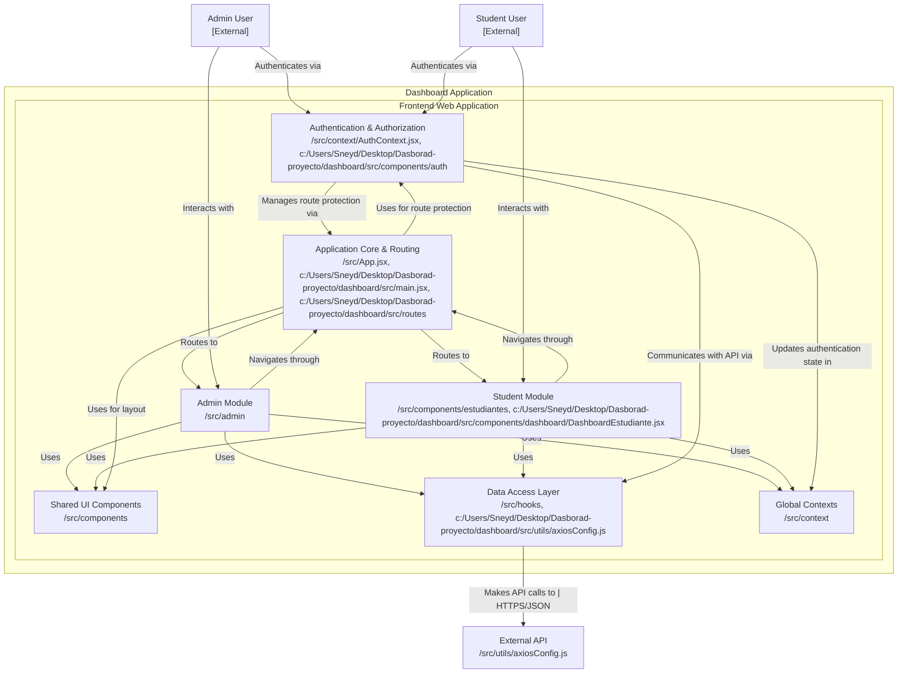

# Unnamed CodeViz Diagram

```mermaid
graph TD

    admin_user["Admin User<br>[External]"]
    student_user["Student User<br>[External]"]
    external_api["External API<br>/src/utils/axiosConfig.js"]
    subgraph dashboard_system["Dashboard Application<br>[External]"]
        subgraph frontend_web_app_boundary["Frontend Web Application<br>[External]"]
            auth_component["Authentication & Authorization<br>/src/context/AuthContext.jsx, c:/Users/Sneyd/Desktop/Dasborad-proyecto/dashboard/src/components/auth"]
            admin_module["Admin Module<br>/src/admin"]
            student_module["Student Module<br>/src/components/estudiantes, c:/Users/Sneyd/Desktop/Dasborad-proyecto/dashboard/src/components/dashboard/DashboardEstudiante.jsx"]
            ui_library["Shared UI Components<br>/src/components"]
            data_access_layer["Data Access Layer<br>/src/hooks, c:/Users/Sneyd/Desktop/Dasborad-proyecto/dashboard/src/utils/axiosConfig.js"]
            global_contexts["Global Contexts<br>/src/context"]
            app_core_routing["Application Core & Routing<br>/src/App.jsx, c:/Users/Sneyd/Desktop/Dasborad-proyecto/dashboard/src/main.jsx, c:/Users/Sneyd/Desktop/Dasborad-proyecto/dashboard/src/routes"]
            %% Edges at this level (grouped by source)
            admin_module["Admin Module<br>/src/admin"] -->|"Uses"| ui_library["Shared UI Components<br>/src/components"]
            admin_module["Admin Module<br>/src/admin"] -->|"Uses"| data_access_layer["Data Access Layer<br>/src/hooks, c:/Users/Sneyd/Desktop/Dasborad-proyecto/dashboard/src/utils/axiosConfig.js"]
            admin_module["Admin Module<br>/src/admin"] -->|"Uses"| global_contexts["Global Contexts<br>/src/context"]
            admin_module["Admin Module<br>/src/admin"] -->|"Navigates through"| app_core_routing["Application Core & Routing<br>/src/App.jsx, c:/Users/Sneyd/Desktop/Dasborad-proyecto/dashboard/src/main.jsx, c:/Users/Sneyd/Desktop/Dasborad-proyecto/dashboard/src/routes"]
            student_module["Student Module<br>/src/components/estudiantes, c:/Users/Sneyd/Desktop/Dasborad-proyecto/dashboard/src/components/dashboard/DashboardEstudiante.jsx"] -->|"Uses"| ui_library["Shared UI Components<br>/src/components"]
            student_module["Student Module<br>/src/components/estudiantes, c:/Users/Sneyd/Desktop/Dasborad-proyecto/dashboard/src/components/dashboard/DashboardEstudiante.jsx"] -->|"Uses"| data_access_layer["Data Access Layer<br>/src/hooks, c:/Users/Sneyd/Desktop/Dasborad-proyecto/dashboard/src/utils/axiosConfig.js"]
            student_module["Student Module<br>/src/components/estudiantes, c:/Users/Sneyd/Desktop/Dasborad-proyecto/dashboard/src/components/dashboard/DashboardEstudiante.jsx"] -->|"Uses"| global_contexts["Global Contexts<br>/src/context"]
            student_module["Student Module<br>/src/components/estudiantes, c:/Users/Sneyd/Desktop/Dasborad-proyecto/dashboard/src/components/dashboard/DashboardEstudiante.jsx"] -->|"Navigates through"| app_core_routing["Application Core & Routing<br>/src/App.jsx, c:/Users/Sneyd/Desktop/Dasborad-proyecto/dashboard/src/main.jsx, c:/Users/Sneyd/Desktop/Dasborad-proyecto/dashboard/src/routes"]
            auth_component["Authentication & Authorization<br>/src/context/AuthContext.jsx, c:/Users/Sneyd/Desktop/Dasborad-proyecto/dashboard/src/components/auth"] -->|"Communicates with API via"| data_access_layer["Data Access Layer<br>/src/hooks, c:/Users/Sneyd/Desktop/Dasborad-proyecto/dashboard/src/utils/axiosConfig.js"]
            auth_component["Authentication & Authorization<br>/src/context/AuthContext.jsx, c:/Users/Sneyd/Desktop/Dasborad-proyecto/dashboard/src/components/auth"] -->|"Updates authentication state in"| global_contexts["Global Contexts<br>/src/context"]
            auth_component["Authentication & Authorization<br>/src/context/AuthContext.jsx, c:/Users/Sneyd/Desktop/Dasborad-proyecto/dashboard/src/components/auth"] -->|"Manages route protection via"| app_core_routing["Application Core & Routing<br>/src/App.jsx, c:/Users/Sneyd/Desktop/Dasborad-proyecto/dashboard/src/main.jsx, c:/Users/Sneyd/Desktop/Dasborad-proyecto/dashboard/src/routes"]
            app_core_routing["Application Core & Routing<br>/src/App.jsx, c:/Users/Sneyd/Desktop/Dasborad-proyecto/dashboard/src/main.jsx, c:/Users/Sneyd/Desktop/Dasborad-proyecto/dashboard/src/routes"] -->|"Uses for route protection"| auth_component["Authentication & Authorization<br>/src/context/AuthContext.jsx, c:/Users/Sneyd/Desktop/Dasborad-proyecto/dashboard/src/components/auth"]
            app_core_routing["Application Core & Routing<br>/src/App.jsx, c:/Users/Sneyd/Desktop/Dasborad-proyecto/dashboard/src/main.jsx, c:/Users/Sneyd/Desktop/Dasborad-proyecto/dashboard/src/routes"] -->|"Routes to"| admin_module["Admin Module<br>/src/admin"]
            app_core_routing["Application Core & Routing<br>/src/App.jsx, c:/Users/Sneyd/Desktop/Dasborad-proyecto/dashboard/src/main.jsx, c:/Users/Sneyd/Desktop/Dasborad-proyecto/dashboard/src/routes"] -->|"Routes to"| student_module["Student Module<br>/src/components/estudiantes, c:/Users/Sneyd/Desktop/Dasborad-proyecto/dashboard/src/components/dashboard/DashboardEstudiante.jsx"]
            app_core_routing["Application Core & Routing<br>/src/App.jsx, c:/Users/Sneyd/Desktop/Dasborad-proyecto/dashboard/src/main.jsx, c:/Users/Sneyd/Desktop/Dasborad-proyecto/dashboard/src/routes"] -->|"Uses for layout"| ui_library["Shared UI Components<br>/src/components"]
        end
    end
    %% Edges at this level (grouped by source)
    admin_user["Admin User<br>[External]"] -->|"Authenticates via"| auth_component["Authentication & Authorization<br>/src/context/AuthContext.jsx, c:/Users/Sneyd/Desktop/Dasborad-proyecto/dashboard/src/components/auth"]
    admin_user["Admin User<br>[External]"] -->|"Interacts with"| admin_module["Admin Module<br>/src/admin"]
    student_user["Student User<br>[External]"] -->|"Authenticates via"| auth_component["Authentication & Authorization<br>/src/context/AuthContext.jsx, c:/Users/Sneyd/Desktop/Dasborad-proyecto/dashboard/src/components/auth"]
    student_user["Student User<br>[External]"] -->|"Interacts with"| student_module["Student Module<br>/src/components/estudiantes, c:/Users/Sneyd/Desktop/Dasborad-proyecto/dashboard/src/components/dashboard/DashboardEstudiante.jsx"]
    data_access_layer["Data Access Layer<br>/src/hooks, c:/Users/Sneyd/Desktop/Dasborad-proyecto/dashboard/src/utils/axiosConfig.js"] -->|"Makes API calls to | HTTPS/JSON"| external_api["External API<br>/src/utils/axiosConfig.js"]

```
---
*Generated by [CodeViz.ai](https://codeviz.ai) on 10/30/2025, 3:56:55 PM*
